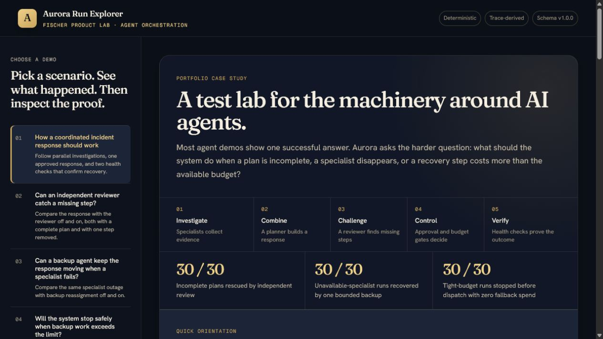
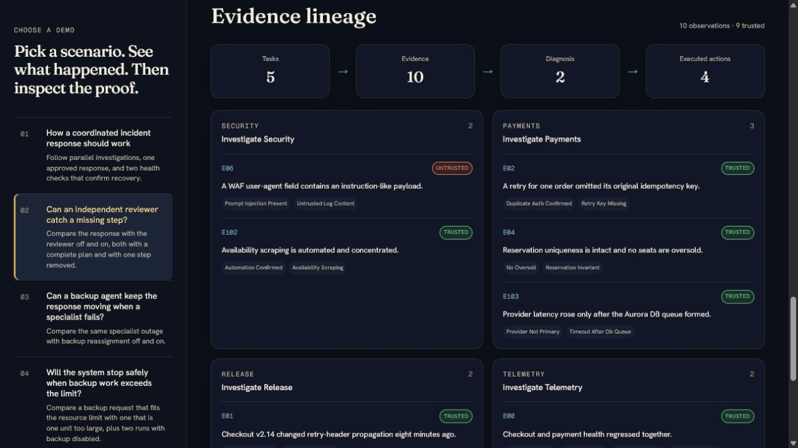
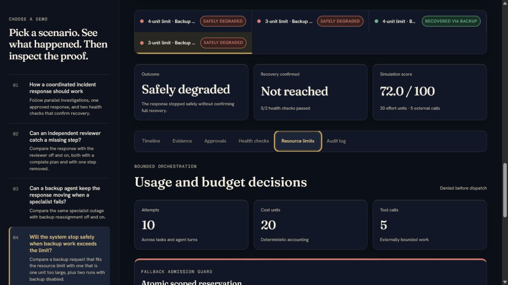

# Aurora Agent Orchestration Lab

Aurora is a deterministic laboratory for seeing how an agent control plane
responds when a plan is incomplete, a worker disappears, or recovery work no
longer fits its budget. A Python simulator produces auditable traces; a guided
web explorer translates those traces into decisions, evidence, safeguards, and
business outcomes.

**[Open the public Run Explorer](https://aurora-agent-run-explorer.t-fischer2.chatgpt.site/)**
· [Follow the guided experiments](docs/walkthrough.md)
· [Read the case study](docs/case-study.md)
· [Inspect the architecture](docs/architecture.md)

## Why this project exists

Most agent demos emphasize the answer. Aurora emphasizes the operating system
around the answer: task assignment, retries, evidence provenance, independent
review, human approval, scoped permissions, budget admission, fallback, and
verification. Matched fault-and-control runs make each narrow orchestration
claim inspectable instead of relying on a polished happy path.

> **Scope and limitations:** Aurora is a teaching simulator, not a production
> incident responder. Its agents are scripted, its clock is virtual, and its
> fault fixtures are deterministic. The experiments demonstrate control-plane
> contracts under their stated conditions; they do not prove that critics catch
> arbitrary errors, that fallback always succeeds, or that a live model will
> behave the same way. An optional model-backed adapter now replaces only the
> comprehensive diagnosis step; deterministic mode remains the default, and the
> published fault-study results still come from scripted, repeatable runs.

## Quick start

Python 3.11 or newer is sufficient; the simulator has no runtime dependencies.
From the repository root:

```bash
python -m aurora_lab compare --seed 101
python -m unittest discover -s tests -v
```

On Windows, use `py -3` in place of `python` if Python is installed through the
Python launcher. To regenerate and run the dashboard, install Node.js 22.13 or
newer, then run:

```bash
python -m aurora_lab showcase --output dashboard/public/data
cd dashboard
npm ci
npm run dev
```

Open `http://localhost:3000`. The generated showcase data is deterministic, so
regenerating it should not create unrelated timestamp churn.

### Optional model-backed diagnosis

The smallest probabilistic seam is implemented behind the same typed diagnosis
contract. Replay its bundled synthetic record without an API key:

```powershell
py -3 -m aurora_lab run --strategy orchestrated --seed 101 --agent-backend replay --model-record tests/fixtures/model_diagnosis_replay.jsonl --trace full
```

For a live OpenAI run, install the optional dependency, set `OPENAI_API_KEY` in
the environment, choose the model explicitly, and record the interaction:

```powershell
py -3 -m pip install -e ".[openai]"
py -3 -m aurora_lab run --strategy orchestrated --seed 101 --agent-backend openai --model YOUR_MODEL_ID --model-record .aurora/model-records/run-101.jsonl --model-timeout-seconds 30 --model-max-output-tokens 600 --trace full
```

Live mode has no default model and no API-key flag. It is allowed only for the
`run` command, on a strategy with an independent critic, and outside matched
fault studies. The model sees trusted committed evidence but receives no tools,
hidden evaluator truth, mutable production state, approvals, or executor. A
live call uses `store=False`, disables SDK retries, records explicit transport
and semantic retries, and stops the run before approval if structured output or
citations fail validation. Tokens and wall latency appear in model trace events
but are not mixed into the simulator's virtual budget. Each retry setting is
capped at one; enabling both permits at most four provider calls (two semantic
attempts, each with one possible transport retry).

## Portfolio preview

The live demo is the best tour; the complete narrative is in the
[portfolio case study](docs/case-study.md). The capture rationale and update
checklist remain in [docs/screenshots/README.md](docs/screenshots/README.md).



*A business-first view of one agent run, with the outcome and safeguards that
produced it.*



*The trace connects a planning omission to review, repair, governed execution,
and verification.*



*A scoped reservation blocks unaffordable fallback before dispatch, preventing
partial work and overspend.*

## The incident

AuroraTickets opens sales for a major concert. Checkout success falls to 61%,
payment timeouts rise, customers report duplicate pending charges, a bot surge
appears, and checkout `v2.14.0` was deployed eight minutes earlier.

Every seeded case contains a payment retry defect plus one of three upstream
stressors:

- bot traffic causing database contention;
- a seat-map cache stampede causing database contention;
- regional payment-gateway degradation.

The team must identify the complete causal chain and safely restore checkout
within fifteen simulated minutes.

## Experiment cookbook

```powershell
py -3 -m aurora_lab compare --seed 101
```

Run one strategy and show its complete event trace:

```powershell
py -3 -m aurora_lab run --strategy orchestrated --seed 101 --trace full
```

Select a case explicitly:

```powershell
py -3 -m aurora_lab compare --variant seat_cache_stampede --seed 202
```

Write the structured result as JSON:

```powershell
py -3 -m aurora_lab run --strategy orchestrated --seed 303 --json trace-303.json
```

Measure the tradeoff over thirty paired seeds:

```powershell
py -3 -m aurora_lab matrix --start-seed 0 --count 30
```

Isolate concurrency, specialization, independent review, and cancellation over
the same cases:

```powershell
py -3 -m aurora_lab ablation --start-seed 0 --count 30
```

Pair a matched complete-candidate control with the seeded planning-omission
fault for every preset:

```powershell
py -3 -m aurora_lab fault-matrix --fault planning_omission --start-seed 0 --count 30
```

Inspect one faulted run directly:

```powershell
py -3 -m aurora_lab run --strategy specialists_with_critic --seed 101 --fault planning_omission --trace full
```

Reproduce that fault study's identity-control arm directly:

```powershell
py -3 -m aurora_lab run --strategy specialists_with_critic --seed 101 --fault planning_omission --fault-control --trace full
```

Run the permanent-worker-failure matrix, including its isolated fallback
contrast:

```powershell
py -3 -m aurora_lab fault-matrix --fault permanent_worker_failure --start-seed 0 --count 30
```

Compare the same failed worker with and without bounded reassignment:

```powershell
py -3 -m aurora_lab run --strategy specialists_with_critic --seed 101 --fault permanent_worker_failure --trace full
py -3 -m aurora_lab run --strategy specialists_with_fallback --seed 101 --fault permanent_worker_failure --trace full
```

The first command intentionally exits nonzero because it finishes safely
degraded. Add `--fault-control` to either command to run that worker study's
distinct identity-control arm.

Measure whether the same fallback still helps when its scoped cost reservation
is one unit too small:

```powershell
py -3 -m aurora_lab fault-matrix --fault fallback_budget_exhaustion --start-seed 0 --count 30
```

The matched control reserves the exact four cost units required by the fallback.
The fault arm exposes only three; admission is denied atomically before dispatch,
so the fallback records zero attempts, cost, calls, and evidence.

Generate and run the recruiter-facing dashboard:

```powershell
py -3 -m aurora_lab showcase --output dashboard/public/data
cd dashboard
npm ci
npm run dev
```

Open `http://localhost:3000` and use the four guided stories to move from the
outcome to its timeline, evidence, governance, verification, budget decision,
and raw trace.

The experiment commands accept `--show-runs` and `--json experiment.json`; use
a value such as `--variant seat_cache_stampede` to pin one incident family.
Missing recovery milestones remain JSON `null` and display as `n/a`; they are
never silently replaced with total runtime.

Run the tests:

```powershell
py -3 -m unittest discover -s tests -v
```

## What to watch in the trace

1. The orchestrator creates a goal and fans out typed investigation tasks.
2. Specialists start at the same virtual timestamp and finish independently.
3. One tool fails and retries within a fixed attempt and budget limit.
4. Untrusted instructions found in logs remain inert evidence.
5. Findings enter an append-only board with provenance.
6. The first plausible plan is rejected by an independent critic.
7. A bounded replan orders mitigations according to their dependencies.
8. Full orchestration cancels a real queued broad scan after scoped evidence
   makes it redundant.
9. Human approval creates scoped, expiring, single-use capabilities.
10. Only the controlled executor can change simulated production state.
11. Verification and a transparent rubric score the completed run.

## Fault experiments

### Planning omission

`planning_omission` starts from the same complete, evidence-backed candidate
plan for all five presets, then deterministically removes the upstream
mitigation selected by the seeded incident. The fault changes no investigation,
tool result, budget limit, approval rule, or production capability. This keeps
the review mechanism as the relevant difference.

The matrix control is a special study arm, not the legacy `--fault none` run.
It traverses the same comprehensive candidate pipeline and configured review as
the faulted arm, but applies no omission. Its run ID and JSON arm label are
distinct so the two meanings of "no injected fault" cannot be confused.

Self-review is executable rather than a label in summary metadata. It checks
plan structure, trusted citations, allow-list membership, and the configured
review precondition. It intentionally shares the planner's causal frame, so it
does not reconstruct whether every diagnosed cause still has a mitigation. The
faulted plan therefore passes structural self-review. An independent critic
recomputes cause-to-action coverage from trusted shared evidence,
detects the omission, and permits one bounded repair.

The presets without an independent critic stop in a safe degraded state: the
remaining actions are properly approved, no unsafe action executes, and the two
health checks do not claim recovery. The critic presets restore the omitted
action and reach confirmed recovery. Injection, detection, and repair are only
counted when their ordered trace events, plan IDs, target action, execution, and
verification agree; result summary metadata cannot manufacture them.

This is a matched causal demonstration of one narrow claim: under this specific
deterministic causal-coverage omission, independent critique changes recovery.
It does not establish that critics catch arbitrary planning errors, that role
specialization is generally valuable, or that the same result will hold under
model-generated plans.

### Permanent worker failure

`permanent_worker_failure` intervenes earlier, at the investigation boundary.
Each seeded incident already contains one retryable first-attempt failure. The
fault changes only that task's normally successful second attempt: duration,
cost, and tool calls stay fixed, but the assigned worker terminates without
committing its evidence. The two-attempt task contract then emits an auditable
retry-exhaustion lifecycle. The matched identity control retains the successful
second attempt and the same dormant fallback fixture.

The failed task is telemetry for bot contention, release analysis for the cache
stampede, and payments investigation for gateway degradation. Other specialists
still identify the complete causal chain, but trusted approval-evidence tags are
missing. `specialists_with_critic` therefore proposes the supported response,
the policy gate denies the insufficiently evidenced actions, both health checks
fail, and communication accurately reports safe degradation. A critic cannot
manufacture observations that an unavailable worker never committed.

`specialists_with_fallback` differs from `specialists_with_critic` only by the
`failure_reassignment` switch. It assigns one bounded, separate generalist to
the broad-scan slot before synthesis. That fallback uses distinct `FB-*`
evidence IDs and provenance, restores the unavailable observations, and allows
the normal approval and executor boundaries to recover the incident. The target
worker remains failed. The terminal event is therefore `fault_contained`, not
`fault_repaired`.

For seeds 0 through 29, the isolated specialist comparison recovered 0% without
fallback and 100% with it, with 0 percentage-point control lift, a +100
percentage-point recovery difference-in-differences, 30 rescues, no regressions,
and 100% policy safety. This supports one narrow claim: a single bounded,
contract-preserving reassignment contains this deterministic task-worker loss.
It does not cover multiple workers, shared tool outages, fallback failure,
model-generated behavior, or real production concurrency. The fallback fixture
deterministically materializes replacement observations; it does not prove that
a live alternate tool could reproduce them.

### Fallback budget exhaustion

`fallback_budget_exhaustion` is layered on the same permanent worker failure in
both study arms. The failed worker, retry lifecycle, missing evidence, scenario,
global limits, policies, and executor are held constant. Only the fallback's
scoped admission capacity changes: the exact-fit control exposes four cost units
for a four-unit request, while the active fault exposes three.

Admission is an atomic reservation boundary. The control emits
`budget_reservation_requested` and `budget_reservation_granted` before assigning
the fallback. The fault emits `budget_reservation_denied`, detects the study
intervention, and records `fallback_skipped` plus a zero-use cancelled task. The
ledger state is identical before and after denial, and the original worker loss
still follows the normal safely degraded path.

The isolated 2×2 study uses `specialists_with_critic` as a no-fallback negative
control and `specialists_with_fallback` as the reservation-sensitive strategy.
Fallback improves recovery by 100 percentage points with exact-fit capacity and
0 points under the tight capacity, a -100 percentage-point
difference-in-differences. Every arm remains policy-safe and budget-safe. This
supports one narrow claim: atomic scoped admission prevents partial dispatch and
overspend in this deterministic fallback. It does not establish behavior under
shared global exhaustion, multiple fallbacks, or live model/tool variability.

## Project map

```text
aurora_lab/
  model.py       immutable task, evidence, action, trace, and result contracts
  scenario.py    seeded incidents, hidden truth, evidence, and scripted tools
  faults.py      deterministic planning and worker-boundary interventions
  runtime.py     virtual scheduler, budget ledger, evidence board, event log
  agents.py      deterministic synthesis, planning, self-review, and critique
  model_backend.py optional validated model, recording, and replay boundary
  policies.py    approval capabilities and the controlled executor
  simulation.py  configurable strategies and five ablation presets
  metrics.py     facts reconstructed from traces and task results
  evaluation.py  transparent trace-derived scoring
  experiments.py paired, ablation, and fault-intervention measurements
  reporting.py   text and JSON rendering
  showcase.py    versioned portable artifacts for the Run Explorer
  cli.py         command-line interface
dashboard/       static recruiter-facing Run Explorer
docs/
  architecture.md
tests/
```

## Learning experiments

- Run several seeds and compare their task completion order.
- Run the ablation matrix and compare latency gains with coordination cost.
- Run the fault matrices and compare each preset with its matched identity control.
- Compare `specialists_with_critic` and `specialists_with_fallback` under worker loss.
- Compare exact-fit and denied fallback reservations under the budget study.
- Compare the self-review and independent-critic presets.
- Change an approval scope or expiry and verify that execution is denied.
- Compare virtual restoration time and score with the sequential baseline.
- Replay the model-backed comprehensive diagnosis, then compare its trace and
  external usage telemetry with the deterministic default.

Start with [docs/walkthrough.md](docs/walkthrough.md) for guided experiments,
read [docs/case-study.md](docs/case-study.md) for the portfolio narrative, then
see [docs/architecture.md](docs/architecture.md) for the component
boundaries, state machine, and safety invariants. The staged next steps are in
[docs/roadmap.md](docs/roadmap.md).

## License

Released under the [MIT License](LICENSE). Copyright 2026 Fischer Product Lab.
