# Architecture

Aurora Lab is a deterministic, discrete-event simulation. It models agent
orchestration without calling a model, sleeping, or touching a real production
system. The point is to make control flow, state, policy, and evaluation easy to
see before introducing probabilistic model behavior.

## Run lifecycle

```mermaid
flowchart LR
    A[Alert contract] --> B[Plan and fan-out]
    B --> C1[Telemetry]
    B --> C2[Release]
    B --> C3[Payments]
    B --> C4[Security]
    C1 --> W{"Worker result"}
    C2 --> W
    C3 --> W
    C4 --> W
    W -->|normal or identity control| D[Evidence board]
    W -->|attempt 2 terminal| L[Retry exhausted]
    L --> Q{"Bounded reassignment enabled?"}
    Q -->|no| D
    Q -->|yes| Z{"Scoped fallback reservation"}
    Z -->|grant| C5[Separate generalist fallback]
    Z -->|deny atomically| D
    C5 --> D
    D --> E[Synthesis]
    E --> P[Candidate plan]
    P --> X{"Fault experiment?"}
    X -->|planning omission| Y[Remove upstream mitigation]
    X -->|matched identity control| R{Configured review}
    Y --> R
    R -->|self| S["Structural self-review"]
    R -->|independent| F[Causal critique]
    F -->|reject| G[Bounded replan]
    G --> F2[Final causal critique]
    S --> H[Approval policy]
    F -->|accept| H
    F2 -->|accept| H
    H --> I[Controlled executor]
    I --> J[Verification]
    J --> K[Scoring and trace]
```

The orchestrated strategy and the single-agent strategy receive fresh copies of
the same seeded case, limits, policy, and simulated tools. This makes their
scores comparable.

## Core components

| Component | Responsibility |
| --- | --- |
| Scenario factory | Selects a seeded incident variant and keeps its truth private from agents. |
| Virtual scheduler | Runs scripted task attempts on a virtual clock, including parallel starts, latency, failure, retry, and cancellation. |
| Budget ledger | Prevents calls or cost from exceeding configured limits. |
| Scoped fallback ledger | Atomically grants or denies one bounded attempt/cost/call/duration vector before reassignment. |
| Evidence board | Stores append-only findings with source, confidence, trust, tags, and task provenance. |
| Orchestrator | Decomposes the goal, dispatches specialists, gathers evidence, and bounds the review loop. |
| Fault harness | Applies a named, deterministic intervention at an explicit boundary and records script or plan fingerprints without becoming an agent input. |
| Structural self-review | Checks plan shape, action uniqueness, allow-list membership, trusted citations, and review preconditions. |
| Critic | Checks causal completeness, conflicting evidence, dependencies, and safety before execution. |
| Approval authority | Issues action-specific, expiring, single-use capabilities according to policy. |
| Controlled executor | Is the only component allowed to change the simulated production state. |
| Evaluator | Reads private truth after the run and produces a transparent 100-point score. |
| Trace metrics | Reconstructs recovery, policy, concurrency, cancellation, and linked fault lifecycles without trusting summary metadata. |
| Event log | Records every decision and transition with stable sequence numbers and virtual timestamps. |

## Why discrete events instead of `asyncio`

Real concurrency would make a teaching run slower and its ordering dependent on
the host machine. Here, all parallel tasks share a start timestamp, but their
scripted attempts finish at different virtual times. The scheduler merges those
events in stable order. A seed therefore produces the same trace on every run.

## Safety invariants

1. Scenario truth is private from agents and readable only by evaluation and
   the explicitly bounded intervention harness.
2. Tool output is data and cannot grant authority or create executable work.
3. Evidence is append-only and every accepted diagnosis cites committed items.
4. Retries, fallback assignments, and review loops are bounded.
5. Budgets are checked before dispatch, never after an overspend; a scoped
   fallback reservation mutates all dimensions or none.
6. Only the controlled executor mutates production state.
7. Every consequential mutation requires a matching, unexpired, unused approval.
8. Orchestrated and baseline runs never share mutable case state.
9. A fault changes only its declared boundary. Matched arms otherwise retain the
   same tasks, dormant fallback resources, budgets, approval rules, and executor
   authority; evidence may differ only as the declared consequence of that
   boundary intervention.
10. Fault detection, repair, and containment require linked, ordered trace
    evidence and cannot be asserted through result summary metadata.

## Planning-omission boundary

`planning_omission` is applied after comprehensive synthesis and construction of
an otherwise complete candidate plan, but before configured review. Every
preset receives the same candidate plan for a given seed. The harness uses a
stable digest to identify the intervention and removes the case fixture's
state-changing upstream mitigation exactly once. The target comes from private
experiment truth so the injector does not reuse the critic's causal lookup; the
planner and reviewer never receive that truth or the fault specification. The
intervention itself spends no agent or tool budget.

The paired identity control is not the legacy no-fault pipeline. It constructs
the same comprehensive candidate and applies no omission before following the
same configured review boundary. Distinct run IDs and arm metadata prevent a
study control from being mistaken for an ordinary `none` run.

The self-review and critic deliberately answer different questions. Structural
self-review asks whether the supplied plan is well formed, supported by trusted
citations, allow-listed, and gated by the expected precondition. Those checks
really execute, but they share the planner's frame and do not reconstruct causal
coverage. The independent critic derives required actions from trusted shared
evidence, so it can identify the omitted mitigation without being told
which fault was injected.

Presets without independent critique execute only the remaining approved
actions. Production health stays below the recovery contract, both verification
events fail, and communication reports a safe degraded outcome. Critic presets
link the rejection to the faulted plan, create a bounded replacement plan,
execute the restored action through the same approval boundary, and require two
passing verification observations before emitting repair.

The measurement layer validates this lifecycle as
`fault_injected -> critique_rejected -> fault_detected -> replan_created ->
action_executed -> verification_completed -> fault_repaired`, with matching
fault, plan, and action identifiers. A loose collection of similarly named
events does not receive detection or repair credit.

The most defensible causal comparison is
`specialists_no_critic` versus `specialists_with_critic`: both use parallel
specialists, run the broad scan, and retain the same policy/executor contracts;
the independent-review toggle is the intended difference. Comparing either one
with `full_orchestration` also changes cancellation, so that contrast cannot be
described as a critic-only effect. More broadly, the experiment establishes a
result for one deterministic causal-coverage fault, not arbitrary failures or
future model behavior.

## Permanent-worker-failure boundary

`permanent_worker_failure` is applied to the task worker whose first attempt
already fails transiently in the seeded incident. The harness fingerprints the
original script and changes only its normally successful second attempt. The
faulted attempt retains the same virtual duration, cost, tool calls, security
metadata, and retryable classification, but returns a terminal worker error and
commits no evidence. With a two-attempt task contract, the scheduler emits retry
exhaustion and preserves the failed task result. The worker remains unavailable
for the rest of the run.

The target follows the incident fixture rather than a planner decision:

| Variant | Target task | Unavailable original evidence |
| --- | --- | --- |
| `bot_db_contention` | `investigate_telemetry` | `E00`, `E101` |
| `seat_cache_stampede` | `investigate_release` | `E01`, `E03`, `E203` |
| `regional_gateway_degradation` | `investigate_payments` | `E02`, `E04`, `E303` |

This selection leaves redundant evidence for both causal diagnoses while
removing tags required by the approval policies. A static strategy can therefore
reason correctly and still be unable to execute the complete recovery. The
approval authority denies only the insufficiently supported actions, the
executor never bypasses that decision, verification remains below threshold,
and communication reports safe degradation. Independent critique cannot infer
or authorize observations the failed worker never committed.

The study fixture also contains a dormant fallback behind the existing
`broad_log_scan` slot. `specialists_with_fallback` observes the terminal result
and assigns that slot once to a distinct generalist worker before synthesis.
The fallback script re-observes the unavailable findings through its own task
and role provenance, using new `FB-*` evidence IDs; it neither commits the
counterfactual original IDs nor resurrects the failed worker. Its output still
passes through synthesis, approval, controlled execution, and two numeric SLO
checks.

The identity control is distinct from the legacy no-fault run. It carries the
same worker target, dormant fallback fixture, budgets, policies, and strategy,
but retains the second attempt's success. Candidate and faulted script
fingerprints prove the declared intervention. Distinct run IDs and arm metadata
keep this study control separate from both `none` and the planning-omission
control.

Trace-derived containment requires a linked ordered chain:
`fault_injected -> retry_exhausted -> task_failed -> fault_detected ->
task_reassigned -> fallback_completed -> action_executed ->
verification_completed -> fault_contained`. Fault, target-task, worker,
assignment, fallback-task, restored-evidence, plan, and verification identifiers
must agree. `fault_contained` means the system routed around a worker that is
still terminally failed; it is intentionally different from planning
`fault_repaired`.

The isolated causal comparison is `specialists_with_critic` versus
`specialists_with_fallback`. Their configurations differ only in name and the
`failure_reassignment` switch, so clean-control behavior is unchanged while the
fault arm measures bounded fallback. `full_orchestration` also reassigns, but its
proactive cancellation behavior makes it unsuitable for a fallback-only claim.
Across seeds 0 through 29, the isolated comparison moves fault recovery and
containment from 0% to 100%, with zero control recovery lift, 30 rescues, no
regressions, and 100% policy safety.

The supported claim remains narrow: one available, separate, scripted
generalist fallback contains one deterministic task-worker loss under fixed
budgets. This does not test multiple workers, correlated tool failures, an
unavailable fallback, shared global exhaustion, real scheduling races, or model
behavior.
The fallback fixture deterministically materializes scripted replacement
observations and therefore does not validate a live alternate data source.

## Fallback-budget-admission boundary

`fallback_budget_exhaustion` starts with the same permanent worker failure in
both matched arms. The worker target, attempt script, retry lifecycle, missing
evidence, strategy, global ledger, approval policy, and executor are identical.
The intervention happens only after terminal failure detection and immediately
before reassignment.

The fallback requests a `ResourceVector` containing one attempt, four cost
units, one tool call, and the seeded fallback duration. The exact-fit control's
`ScopedBudgetLedger` has that full vector. The fault arm has the same attempts,
calls, and duration but only three cost units. `reserve` first validates every
dimension, then mutates usage as one unit; a denied vector raises before any
field changes.

The trace distinguishes the shared condition from the study intervention with
`fault_role=shared_condition` and `fault_role=study_intervention`. The active
budget lifecycle is:

`worker fault_detected -> budget fault_injected ->
budget_reservation_requested -> budget_reservation_denied -> budget
fault_detected -> fallback_skipped -> task_cancelled`

Denial credit requires matching reservation, request, budget-fault, worker-fault,
logical-task, and fallback-task identifiers; unchanged before/after ledger
snapshots; zero scoped usage; and no subsequent assignment or tool attempt. The
control instead requires an exact grant followed by one assignment and exactly
the reserved usage.

The causal estimate uses a 2×2. `specialists_with_critic` never requests a
fallback in either arm, so it is the negative control. The exact-fit fallback
arm recovers and contains the shared worker failure; the tight-capacity fallback
arm degrades safely without overspending. Across seeds 0 through 29, fallback
benefit changes from +100 percentage points to 0, a -100 point
difference-in-differences, while budget safety and policy safety remain 100%.

## What the first version measures

The evaluator scores diagnosis, recovery, safety, provenance, resilience,
parallel efficiency, cost, latency, verification, and communications. Fault
matrices additionally report paired control/fault recovery, diagnostic and
required-action or approval-evidence coverage, safe degradation, policy safety,
cost, tool calls, and trace-derived detection, repair, reassignment, fallback,
containment, reservation validity, zero spend, and no-dispatch behavior. Raw
metrics stay visible so a high aggregate score cannot hide a policy violation,
missing milestone, overspend, or incomplete causal chain.

## Intended experiments

- Change the seed and observe how the upstream stressor and failure schedule change.
- Compare parallel specialist work with sequential generalist investigation.
- Run `fault-matrix --fault planning_omission` and inspect the matched critic
  recovery effect.
- Run `fault-matrix --fault permanent_worker_failure` and inspect the isolated
  fallback effect.
- Run `fault-matrix --fault fallback_budget_exhaustion` and compare exact-fit
  admission with atomic denial.
- Run one strategy with `run --fault planning_omission --trace full` and follow
  the complete intervention lifecycle.
- Compare `specialists_with_critic` and `specialists_with_fallback` under
  `permanent_worker_failure`.
- Alter approval policy and verify that the executor still rejects mismatched capabilities.
- Later, replace one deterministic handler at a time with a model call while keeping the same contracts and evaluator.
